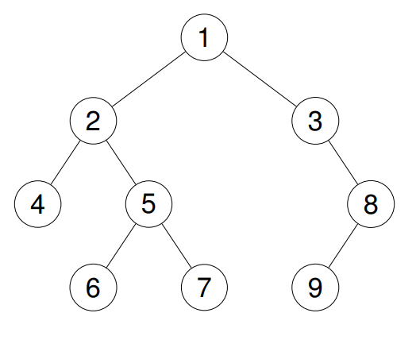

# [0144]. Binary Tree Preorder Traversal

**Difficulty:** Easy  
**Topics:** `Stack`, `Tree`, `Depth-First Search`, `Binary Tree`  
**Companies:** N/A  
**Link:** [Binary Tree Preorder Traversal](https://leetcode.com/problems/binary-tree-preorder-traversal/)

---

## Problem Statement

Given the root of a binary tree, return the preorder traversal of its nodes' values.

**Example 1:**
```
Input: root = [1,null,2,3]

Output: [1,2,3]

Explanation:
```


**Example 2:**
```
Input: root = [1,2,3,4,5,null,8,null,null,6,7,9]

Output: [1,2,4,5,6,7,3,8,9]

Explanation:


```



**Example 3:**
```
Input: root = []

Output: []
```

**Example 4:**
```
Input: root = [1]

Output: [1]
```

**Constraints:**
- The number of nodes in the tree is in the range [0, 100].
- -100 <= Node.val <= 100

---

**Date Solved:** June 02, 2026  
