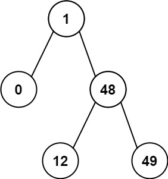

# [0783]. Minimum Distance Between BST Nodes

**Difficulty:** Easy  
**Topics:** `Tree`, `Depth-First Search`, `Breadth-First Search`, `Binary Search Tree`, `Binary Tree`  
**Companies:** N/A  
**Link:** [Minimum Distance Between BST Nodes](https://leetcode.com/problems/minimum-distance-between-bst-nodes/)

---

## Problem Statement

Given the root of a Binary Search Tree (BST), return the minimum difference between the values of any two different nodes in the tree.

**Example 1:**
```
Input: root = [4,2,6,1,3]
Output: 1
```


**Example 2:**
```
Input: root = [1,0,48,null,null,12,49]
Output: 1
```



**Constraints:**
- The number of nodes in the tree is in the range [2, 100].
- 0 <= Node.val <= 10^5

---

**Date Solved:** June 03, 2026  
