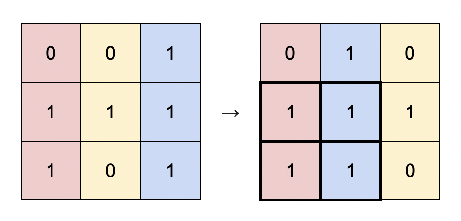
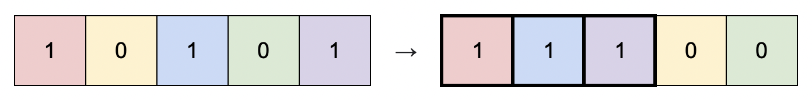

# [1727]. Largest Submatrix With Rearrangements

**Difficulty:** Medium  
**Topics:** `Array`, `Greedy`, `Sorting`, `Matrix`  
**Companies:** N/A  
**Link:** [Largest Submatrix With Rearrangements](https://leetcode.com/problems/largest-submatrix-with-rearrangements/)

---

## Problem Statement

You are given a binary matrix matrix of size m x n, and you are allowed to rearrange the columns of the matrix in any order.

Return the area of the largest submatrix within matrix where every element of the submatrix is 1 after reordering the columns optimally.



**Example 1:**
```
Input: matrix = [[0,0,1],[1,1,1],[1,0,1]]
Output: 4
Explanation: You can rearrange the columns as shown above.
The largest submatrix of 1s, in bold, has an area of 4.
```



**Example 2:**
```
Input: matrix = [[1,0,1,0,1]]
Output: 3
Explanation: You can rearrange the columns as shown above.
The largest submatrix of 1s, in bold, has an area of 3.
```

**Example 3:**
```
Input: matrix = [[1,1,0],[1,0,1]]
Output: 2
Explanation: Notice that you must rearrange entire columns, and there is no way to make a submatrix of 1s larger than an area of 2.
```

**Constraints:**
- m == matrix.length
- n == matrix[i].length
- 1 <= m * n <= 105
- matrix[i][j] is either 0 or 1.

---

## Solutions

### ⭐ Solution 1: Sort By Height On Each Baseline Row
**File:** `Solution1.java`  
**Status:** ✅ Accepted

**Approach:**
- Treat each cell as the height of consecutive `1`s ending at current row:
  - For each row, if `matrix[row][col] == 1`, add height from above: `matrix[row][col] += matrix[row-1][col]`.
- For the current row, clone heights and sort them.
- After sorting (ascending), consider each position `i` as the minimum height of a candidate submatrix using columns `i..n-1`:
  - Width = `n - i`
  - Area = `currRow[i] * (n - i)`
- Track the maximum area across all rows.


**Complexity:**
- ⏱️ Time: O(m * n log n)
- 💾 Space: O(n)

---

## Key Insights

- Column rearrangement lets us reorder heights in each row independently to maximize area.
- For a fixed row, once heights are sorted, choosing a suffix gives the best width for a chosen minimum height.
- Converting matrix values to vertical heights transforms the problem into repeated “largest rectangle from heights with sorting” per row.
- Complexity:
  - Time: `O(m * (n + n log n)) = O(m * n log n)`
  - Space: `O(n)` extra (row clone for sorting)  
  - In-place height accumulation reuses `matrix` itself.

---

**Date Solved:** March 17, 2026  
**Review Count:** 0  
**Next Review:** March 17, 2026
