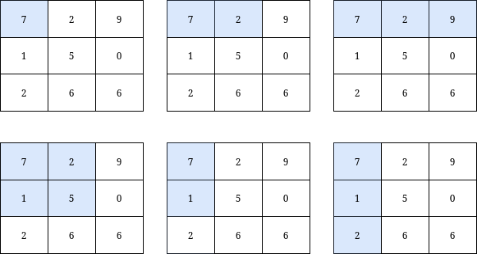

# [3070]. Count Submatrices with Top-Left Element and Sum Less Than k

**Difficulty:** Medium  
**Topics:** `Array`, `Matrix`, `Prefix Sum`  
**Companies:** N/A  
**Link:** [Count Submatrices with Top-Left Element and Sum Less Than k](https://leetcode.com/problems/count-submatrices-with-top-left-element-and-sum-less-than-k/)

---

## Problem Statement

You are given a 0-indexed integer matrix grid and an integer k.

Return the number of submatrices that contain the top-left element of the grid, and have a sum less than or equal to k.


**Example 1:**
```
Input: grid = [[7,6,3],[6,6,1]], k = 18
Output: 4
Explanation: There are only 4 submatrices, shown in the image above, that contain the top-left element of grid, and have a sum less than or equal to 18.
```



**Example 2:**
```
Input: grid = [[7,2,9],[1,5,0],[2,6,6]], k = 20
Output: 6
Explanation: There are only 6 submatrices, shown in the image above, that contain the top-left element of grid, and have a sum less than or equal to 20.
```

**Constraints:**
- m == grid.length 
- n == grid[i].length
- 1 <= n, m <= 1000 
- 0 <= grid[i][j] <= 1000
- 1 <= k <= 109

---

## Solutions

### ⭐ Solution 1: 2D Prefix Sum
**File:** `Solution1.java`  
**Status:** ✅ Accepted

**Approach:**
- Since submatrices must include the top-left cell `(0,0)`, each valid submatrix is uniquely defined by its bottom-right corner `(i,j)`.
- Maintain an array `cols[j]` = cumulative sum of column `j` from row `0..i`.
- For each row `i`:
  - Update `cols[j] += grid[i][j]`.
  - Build running prefix across columns: `rows += cols[j]`, which equals sum of submatrix `(0,0)` to `(i,j)`.
  - If `rows <= k`, increment answer.
- Return total count.


**Complexity:**
- ⏱️ Time: O(n × m)
- 💾 Space: O(n)

---

## Key Insights

- You do not need full 2D prefix matrix; only per-column cumulative sums plus left-to-right running sum per row.
- At row `i`, `rows` at column `j` is exactly the sum of the top-left-anchored submatrix ending at `(i,j)`.
- This converts a 2D prefix problem into a streaming computation with `O(m)` extra space.

---

**Date Solved:** March 18, 2026  
**Review Count:** 0  
**Next Review:** March 18, 2026
